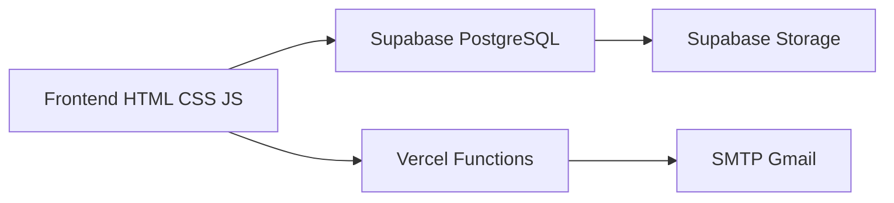

# 🔑 ACRC Imóveis — Sistema Inteligente de Gestão de Chaves Imobiliárias

<p align="center">
Sistema desenvolvido para otimizar a gestão operacional de chaves imobiliárias com rastreabilidade, auditoria e controle em tempo real.
</p>

<p align="center">


</p>

---

# 🌎 Sistema Online

🔗 https://controledechavesacrc.vercel.app

---

# 🚀 Sobre o Projeto

O **ACRC Controle de Chaves** é uma plataforma web desenvolvida para gerenciamento operacional de chaves imobiliárias, oferecendo rastreabilidade completa, auditoria de movimentações e controle em tempo real.

O sistema foi criado para substituir processos manuais em papel e planilhas, centralizando todas as movimentações em uma aplicação moderna, rápida e responsiva.

---

# ✨ Funcionalidades

✅ Controle de retiradas e devoluções<br>
✅ Histórico completo por chave<br>
✅ Auditoria de alterações<br>
✅ Sistema de permissões por perfil<br>
✅ Upload de fotos das chaves<br>
✅ Geração automática de comprovantes PDF<br>
✅ Assinatura digital integrada<br>
✅ Relatórios automáticos por e-mail<br>
✅ Busca e filtros em tempo real<br>
✅ Aplicação PWA instalável<br>
✅ Persistência offline com localStorage<br>
✅ Interface moderna focada em produtividade e usabilidade<br>

---

# 🧠 Arquitetura



---

# ⚙️ Stack Tecnológica

| Camada               | Tecnologia                |
| -------------------- | ------------------------- |
| Frontend             | HTML5 + CSS3 + JavaScript |
| Backend              | Vercel Functions          |
| Banco de Dados       | Supabase PostgreSQL       |
| Storage              | Supabase Storage          |
| Hospedagem           | Vercel                    |
| Emails               | Nodemailer + Gmail SMTP   |
| Mobile               | PWA                       |
| Persistência Offline | localStorage              |

---

# 🚀 Deploy no Vercel

## 1. Clone o projeto

```bash
git clone https://github.com/alexx-al3/acrc-chaves.git
```

---

## 2. Instale as dependências

```bash
npm install
```

---

## 3. Faça deploy

```bash
vercel
```

---

# 🗄️ Configuração do Supabase

## 1. Criar projeto

Acesse:

```text
https://supabase.com
```

Depois:

```text
New Project
```

Defina:

* Nome do projeto
* Senha do banco
* Região

---

## 2. Obter credenciais

Vá em:

```text
Settings → API
```

Copie:

* Project URL
* Anon Public Key

---

# ⚙️ Configurar no Sistema

No início do `index.html`:

```javascript
const SUPA_URL = "https://xxxx.supabase.co";
const SUPA_KEY = "sua-anon-key";
```

---

# 🧱 Estrutura do Banco de Dados

Abra:

```text
Supabase → SQL Editor → New Query
```

Cole o SQL abaixo:

```sql
-- =========================================
-- TABELA DE CHAVES
-- =========================================

CREATE TABLE keys (
  id TEXT PRIMARY KEY,
  loc TEXT NOT NULL,
  codigo TEXT DEFAULT '',
  status TEXT DEFAULT 'LIVRE',
  responsavel TEXT DEFAULT '',
  data_ret TEXT DEFAULT '',
  data_dev TEXT DEFAULT '',
  obs TEXT DEFAULT '',
  foto TEXT DEFAULT '',
  created_at TIMESTAMPTZ DEFAULT NOW(),
  updated_at TIMESTAMPTZ DEFAULT NOW()
);

-- =========================================
-- TABELA DE HISTÓRICO
-- =========================================

CREATE TABLE history (
  id BIGINT PRIMARY KEY DEFAULT extract(epoch from now())*1000,
  tipo TEXT,
  loc TEXT,
  codigo TEXT,
  responsavel TEXT,
  status TEXT,
  ts TIMESTAMPTZ DEFAULT NOW(),
  usuario TEXT,
  perfil TEXT,
  changes JSONB,
  extra JSONB
);

-- =========================================
-- TABELA DE USUÁRIOS
-- =========================================

CREATE TABLE users (
  id TEXT PRIMARY KEY,
  name TEXT,
  user_login TEXT UNIQUE,
  pass TEXT,
  role TEXT,
  created_at TIMESTAMPTZ DEFAULT NOW()
);

-- =========================================
-- HABILITAR RLS
-- =========================================

ALTER TABLE keys ENABLE ROW LEVEL SECURITY;
ALTER TABLE history ENABLE ROW LEVEL SECURITY;
ALTER TABLE users ENABLE ROW LEVEL SECURITY;

-- =========================================
-- POLÍTICAS
-- =========================================

CREATE POLICY "allow_all_keys"
ON keys
FOR ALL
USING (true);

CREATE POLICY "allow_all_history"
ON history
FOR ALL
USING (true);

CREATE POLICY "allow_all_users"
ON users
FOR ALL
USING (true);
```

---

# 📦 Configuração Storage (Fotos)

## Criar bucket

Vá em:

```text
Storage → Create Bucket
```

Nome:

```text
chave-fotos
```

Marque:

```text
Public Bucket
```

---

# ✉️ Configuração de Email

## Variáveis de ambiente no Vercel

Vá em:

```text
Settings → Environment Variables
```

Adicione:

```env
GMAIL_USER=seuemail@gmail.com
GMAIL_PASS=senha-app-google
EMAIL_DEST=destino@email.com
```

Depois faça:

```bash
Redeploy
```

---

# 👥 Usuários de exemplo

| Perfil      | Usuário     |
| --------    | --------    |
| Cadastro    | cadastro    |
| ADM         | adm         |
| Corretor    | corretor    |
| vistoriador | vistoriador |

> ⚠️ Configure suas próprias credenciais diretamente no banco de dados.

---

# 🔒 Recursos de Segurança

✅ Row Level Security (RLS)
✅ Controle de permissões por perfil
✅ Auditoria imutável
✅ Variáveis protegidas no Vercel
✅ Histórico completo de alterações
✅ Sessão autenticada

---

# 📱 Instalação Mobile (PWA)

## iPhone / iPad

Safari → Compartilhar → Adicionar à Tela de Início

## Android

Chrome → Menu → Adicionar à tela inicial

---

# 📂 Estrutura do Projeto

```bash
acrc-chaves/
├── index.html
├── manifest.json
├── vercel.json
├── package.json
├── README.md
├── assets/
│   ├── banner-acrc.png
│   ├── preview.png
│   └── demo.gif
└── api/
    └── send-email.js
```

---

# 🔄 Fluxo Operacional

```text
Login → Busca → Movimentação → Histórico → PDF → Email → Auditoria
```

---

# 🌎 Diferenciais do Projeto

🚀 Sistema real em produção
📱 Aplicação PWA instalável
⚡ Deploy contínuo via GitHub + Vercel
🧠 Desenvolvido em HTML, CSS e JavaScript puro
🔒 Auditoria completa de movimentações
☁️ Infraestrutura cloud escalável
🎨 Interface moderna focada em experiência do usuário

---

# 📈 Possíveis Evoluções

* Dashboard analítico
* Notificações push
* Integração com CRM imobiliário
* Multiunidades
* Assinatura eletrônica jurídica
* App nativo mobile
* Relatórios avançados

---

# 👨‍💻 Desenvolvido por

## Alex Alves

💻 Desenvolvedor de Sistemas
🎨 UI & Experiência Visual
🚀 Criador de Soluções Reais

<p align="left">

<a href="https://linkedin.com/in/alex-alves-40b2721a3">
  
</a>

<a href="https://instagram.com/alexx.al3">
  
</a>

</p>

---

<p align="center">
🚀 Desenvolvendo soluções reais com criatividade, tecnologia e experiência visual.
</p>
